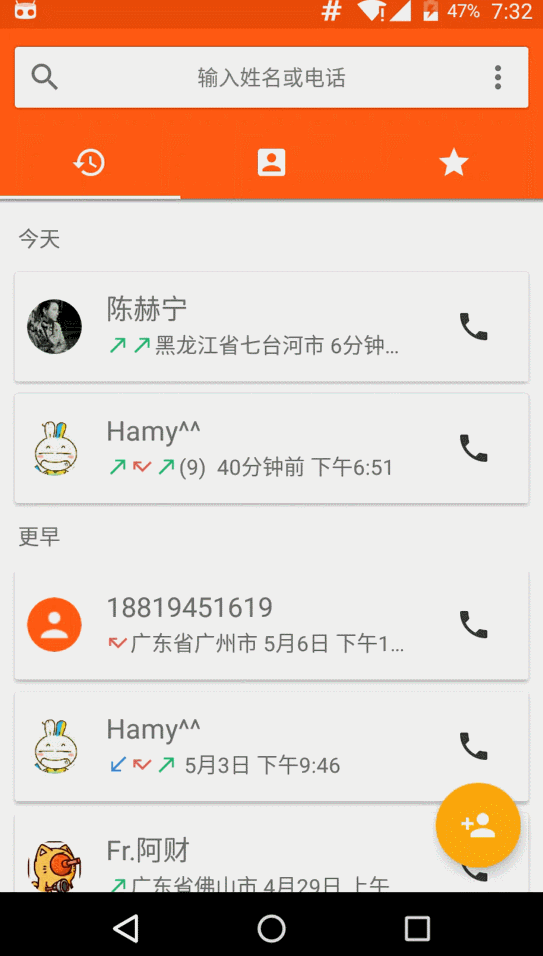

# MyContacts

#### 一款Android平台上简洁易用的家庭通讯录

1. 支持的**Android API** 版本：
  + minSdkVersion 16(4.1 Jelly Bean)
  + targetSdkVersion 23(6.0 Marshmallow)
2. 完全基于**Material Design**

#### 屏幕截图：
 

 
### 功能特性：

+ #### 基础功能：

  1. 通话记录聚合显示、详情显示
  2. 联系人显示、索引、查询
  3. 查看、新增、修改联系人信息  
  4. 收藏以及取消收藏联系人
  5. 实现本地黑名单  

+ #### 特色功能：

  1. 联系人详情显示当地天气
  2. 针对不同联系人发送**关怀短信**（根据天气、联系人称呼、温度三个参数来生成）
  3. 自动添加家庭成员至收藏夹

+  其中联系人信息支持姓名、头像、电话、邮箱、地址等字段，各字段支持自定义类型  
   电话、邮箱、地址字段支持**不定项添加和修改**

+  黑名单支持两个不同的屏蔽粒度：**仅屏蔽单个号码** 和屏蔽 **指定联系人的所有号码** 来电（包括新增的号码）

+  通话详情中包含电话号码、通话时长、联系人信息（姓名和头像）、通话类型以及归属地信息  
   在 *Android 5.0* 以下的平台，归属地是通过查询本地数据库来获得  
   在 *Android 5.0* 及其以上的平台，归属地直接读取自API提供的 *CallLog.Calls.GEOCODED_LOCATION* 字段

### LICENSE
    MyContacts for Android
    Copyright (C) 2016  Kangel Zenn

    This program is free software: you can redistribute it and/or modify
    it under the terms of the GNU General Public License as published by
    the Free Software Foundation, either version 3 of the License, or
    (at your option) any later version.

    This program is distributed in the hope that it will be useful,
    but WITHOUT ANY WARRANTY; without even the implied warranty of
    MERCHANTABILITY or FITNESS FOR A PARTICULAR PURPOSE.  See the
    GNU General Public License for more details.

    You should have received a copy of the GNU General Public License
    along with this program.  If not, see <http://www.gnu.org/licenses/>.
